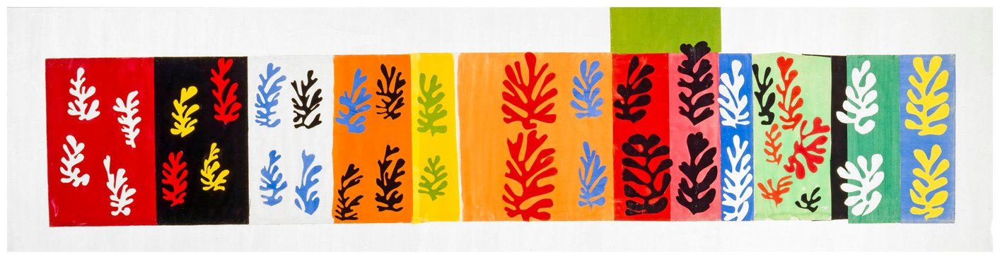
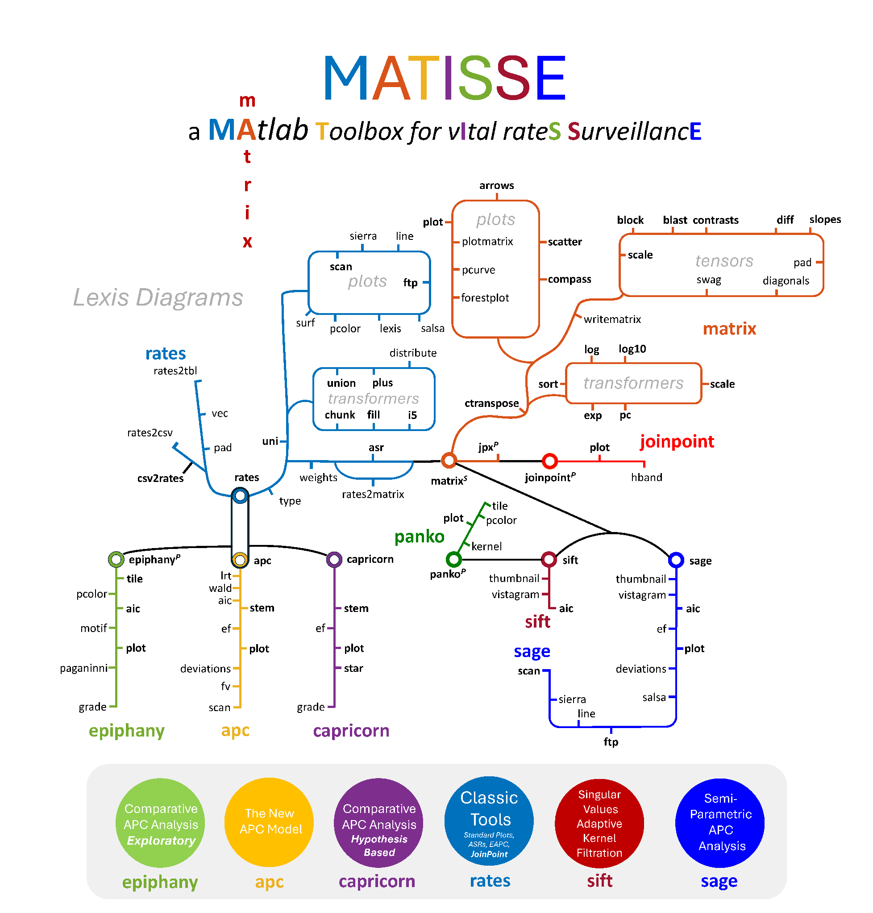
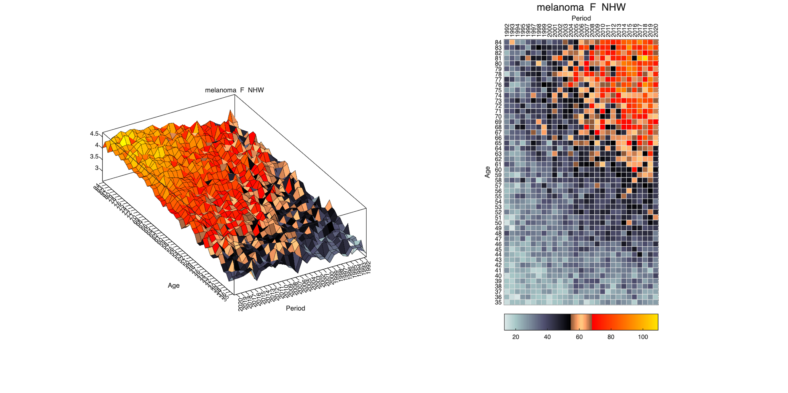
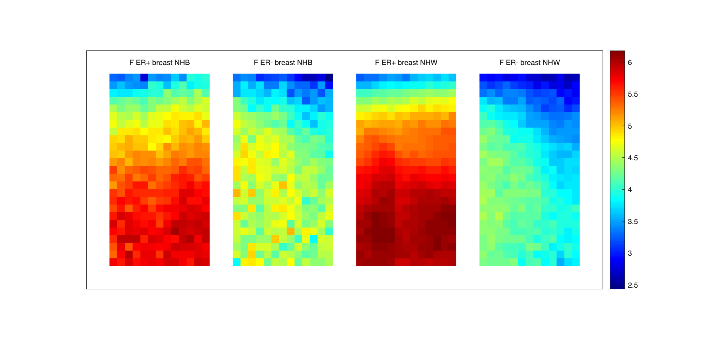

{fig-alt="MATISSE banner, styled after Henri Matisse's paper cut-outs" width="100%"}

::: {.callout-note}
This page is a **working draft**. It's the support page for the MATISSE course and toolbox — content, code examples, and downloads below will keep expanding as the course and its user's guide grow.
:::

## The MATISSE course

MATISSE is being introduced through a short course, alongside the toolbox documentation below. Two formats are planned:

- **Live introductory sessions** — a short, high-level primer on age-period-cohort (APC) methods for epidemiologists, with time set aside for Q&A. Date to be announced.
- **On-demand sessions** — longer, hands-on lectures organized chapter by chapter, working through the toolbox and its `.mlx` user's guide in depth. Recordings and additional materials will be added here as they become available.

The course is aimed at epidemiologists, cancer registry researchers, and biostatisticians interested in age-period-cohort methods for cancer surveillance. Slides and code are shared from this page — see [Downloads](#downloads) below.

## Overview

**MATISSE** is a **MA**TLAB **T**oolbox for v**I**tal rate**S** **S**urveillanc**E**. It was designed and built by **Philip S. Rosenberg, PhD**, to implement the suite of statistical methods that Rosenberg and Adalberto Miranda Filho describe in [*Advances in statistical methods for cancer surveillance research: an age-period-cohort perspective*](https://www.frontiersin.org/journals/oncology/articles/10.3389/fonc.2023.1332429/full) (Frontiers in Oncology, 2024).

MATISSE recapitulates the NCI [Age-Period-Cohort Analysis Web Tool](https://dceg.cancer.gov/tools/analysis/apc) and packages it together with a complementary family of methods, including the new age-period-cohort model, comparative age-period-cohort analysis, smoothing methods for Lexis diagrams, and semiparametric age-period-cohort analysis (see [Related methods and publications](#related-methods-and-publications) below).

A recurring design idea: *"design is a process carried out by people, for people. At its heart is a dialogue between three key people: the designer, the maker and the user."* Rosenberg is MATISSE's designer and maker; its first users are the cancer surveillance researchers who helped shape what the toolbox needed to do.

MATISSE is free to use. You can run it at no cost through [MATLAB Online](https://www.mathworks.com/products/matlab-online.html), or locally if you already have a MATLAB license.

## Design

MATISSE is built as an [object-oriented system](https://www.mathworks.com/company/technical-articles/introduction-to-object-oriented-programming-in-matlab.html) — a concept that will feel familiar to R users. Data and models are represented as **objects** that you manipulate through object-specific **methods**. For example:

- a `rates` object encapsulates a set of age-specific event rates observed over time (a Lexis diagram)
- an `apc` object encapsulates an age-period-cohort analysis fitted to a `rates` object
- a `tbl` object is a lightweight labeled-matrix container, loosely analogous to a `data.frame`
- a `matrix` object pairs a random vector or array with its variance-covariance matrix — described by its author as *"MATISSE's secret sauce"*, since it lets transformations propagate uncertainty automatically instead of requiring hand-written delta-method code

The core classes shipped in the toolbox:

| Class | Purpose |
|---|---|
| `rates` | Age-specific event rates over time (Lexis diagrams); classic descriptive plots, ASRs |
| `apc` | The new age-period-cohort model |
| `epiphany` | Exploratory comparative age-period-cohort analysis |
| `capricorn` | Hypothesis-based comparative age-period-cohort analysis |
| `joinpoint` | Joinpoint regression |
| `sift` | Singular-value adaptive kernel filtration |
| `sage` | Semiparametric age-period-cohort analysis |
| `panko` | Kernel smoothing utilities feeding into `sift` |
| `tbl` / `matrix` | Lightweight labeled-data and error-propagating array containers underlying everything above |

### System map

MATISSE's classes and methods are organized like a transit map — each class is a line, its methods are the stops, and a handful of hub classes (`rates`, `matrix`) let you transfer between them:

```matlab
matisse('map')
```

{fig-alt="Map of MATISSE classes and methods, styled after a subway map" width="90%"}

## Example data

MATISSE ships with 16 built-in example Lexis diagrams drawn from US SEER registry data (1992–2020): breast cancer by ER status and race (NHW/NHB), colon, liver, lung, and thyroid cancer by sex and race, and melanoma. Selecting one and filling any zero cells takes two lines:

```matlab
Example = 16;      % 1x1 age-by-period Lexis diagram, e.g. "F melanoma NHW"
DELTA   = 1;        % chunk to 2x2 or 5x5 age/period blocks if the data are sparse

r = ratesdata(Example);
switch DELTA
    case 1
        R0 = r;
    case 2
        R0 = chunk(r, 'AgeBlock', 2, 'PerBlock', 2);
    case 5
        R0 = chunk(r, 'AgeBlock', 5, 'PerBlock', 5);
end

R = fill(R0);   % add a small value to any zero cells
disp(R)
```

## Visualizing a Lexis diagram

The `rates` class has both a `pcolor` method (absolute rates, heat map) and a `surf` method (log rates, 3-D surface):

```matlab
figure('Position', [0 0 700 700])
pcolor(R)

figure('Position', [0 0 700 700])
surf(R)
```

::: {layout-ncol=1}
{fig-alt="Heat map of melanoma incidence rates by age and period"}
:::

Every plot can be tuned from the command line with ordinary MATLAB graphics calls, or up front with MATISSE's own `go`/`ego` option system — shown here side by side (`surf` on the left, `pcolor` with a custom `nepal` colormap on the right):

```matlab
subplot(1, 2, 1)
surf(R)
colormap nepal
colorbar off
shading faceted

subplot(1, 2, 2)
pvp1 = ego('class', 'rates', 'method', 'pcolor');
pvp1.colormap  = 'nepal';
pvp1.colorbar  = 'southoutside';
pcolor(R, pvp1)
```

{fig-alt="Side by side surf and pcolor plots of the same rates object"}

`go` values are structures of MATLAB property-value pairs; `ego` returns a fresh copy of a given plot method's defaults so you always have a known starting point to edit from. MATISSE also ships a 54-color standard line palette (`clarinet`) plus two purpose-built colormaps, `africa` (green–black–red) and `nepal` (bone–copper–autumn), on top of anything built into MATLAB itself.

## Comparing several Lexis diagrams at once

Surveillance questions are rarely about a single Lexis diagram in isolation. The `thumbnail` and `vistagram` graphics functions generalize `pcolor`/`surf` to two or more same-sized `rates`, `tbl`, or `matrix` objects — here, ER+/ER− breast cancer incidence for non-Hispanic Black and non-Hispanic White women, chunked to 2×2 age/period blocks:

```matlab
r4 = ratesdata([1 3 2 4]);   % ER+ NHB, ER+ NHW, ER- NHB, ER- NHW
t4 = cell(1, 4);
for i = 1:4
    r4{i} = chunk(r4{i}, 'AgeBlock', 2, 'PerBlock', 2);
    t4{i} = type(r4{i}, 'comp', 'lr');   % log rates
end

figure('Position', [0 0 1200 600])
thumbnail(t4)
```

{fig-alt="Four heat maps of log incidence rates side by side, comparing ER status and race"}

## Getting help

Every MATISSE function ships with detailed, hyperlinked help. From the MATLAB command line:

```matlab
help rates/rates          % help for a specific class
methods rates              % list every method of a class
help rates/fill             % help for a specific method
doc('rates')                 % open help in a standalone window
```

## Scripting with MATISSE

The recommended way to start your own analysis is to copy the relevant sections of one of the `.mlx` user's-guide files below, then edit the template to point at your own data. The MATLAB command line doubles as a scratch pad for trying things out before promoting code into a script.

## Downloads

The user's guide is a growing set of MATLAB Live Script (`.mlx`) files, each paired with a PowerPoint lecture; together they form a short course built around the Frontiers in Oncology methods paper. The files below are what exists so far.

| File | Description | Size |
|---|---|---|
| [MATISSE_toolbox.zip](downloads/MATISSE_toolbox.zip) | The toolbox itself: all classes (`@apc`, `@rates`, `@sage`, …), graphics and statistics functions, and the 16 example SEER datasets | 0.9 MB |
| [MATISSE_1_Overview.mlx](downloads/MATISSE_1_Overview.mlx) | User's guide 1: design philosophy, object model, system map, help system, graphics options | 1.2 MB |
| [MATISSE_2_The_Lexis_Diagram.mlx](downloads/MATISSE_2_The_Lexis_Diagram.mlx) | User's guide 2: the `rates` class, `pcolor`/`surf`/`lexis` methods, comparing multiple Lexis diagrams | 2.6 MB |
| [Statistical_Methods_in_CSR.pptx](downloads/Statistical_Methods_in_CSR.pptx) | Course slides: statistical methods in cancer surveillance research | 1.0 MB |
| [The_Lexis_Diagram.pptx](downloads/The_Lexis_Diagram.pptx) | Course slides: the Lexis diagram | 3.1 MB |
| [SEER_CI5plus_to_APC_WebTool.pptx](downloads/SEER_CI5plus_to_APC_WebTool.pptx) | Course slides: from SEER/CI5+ data to the APC web tool | 1.8 MB |
| [Miranda-Filho_Rosenberg_2024_FrontOncol.pdf](downloads/Miranda-Filho_Rosenberg_2024_FrontOncol.pdf) | Miranda Filho & Rosenberg, *Advances in statistical methods for cancer surveillance research: an age-period-cohort perspective*, Front Oncol 2024 | 4.4 MB |
| [Rosenberg_2023_BMCMedResMethodol.pdf](downloads/Rosenberg_2023_BMCMedResMethodol.pdf) | Comparative age-period-cohort analysis reference (BMC Med Res Methodol 2023) | 6.2 MB |

## Related methods and publications {#related-methods-and-publications}

- [Age-Period-Cohort Analysis Web Tool](https://dceg.cancer.gov/tools/analysis/apc) (NCI DCEG) — [description](https://aacrjournals.org/cebp/article/23/11/2296/14669/A-Web-Tool-for-Age-Period-Cohort-Analysis-of)
- [The new age-period-cohort model](https://journals.sagepub.com/doi/10.1177/0962280218801121)
- [Comparative age-period-cohort analysis](https://link.springer.com/article/10.1186/s12874-023-02039-8)
- [Smoothing methods for Lexis diagrams](https://journals.sagepub.com/doi/10.1177/09622802231192950)
- [Semiparametric age-period-cohort analysis](https://jamanetwork.com/journals/jamanetworkopen/fullarticle/2819747)

## Project team

::: {.team-grid}
- **Philip S. Rosenberg, PhD** — Project lead; toolbox architecture and code
- **Hyuna Sung, PhD**, and team
- **Adalberto Miranda Filho**
- **Yasmmin Martins**
:::

MATISSE's toolbox architecture and code are the work of Philip S. Rosenberg, PhD, implementing methods developed jointly with the cancer surveillance research community — in particular the age-period-cohort framework described with Adalberto Miranda Filho in Front Oncol 2024. The course built around it is a collaboration between the team above.
